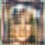
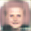
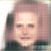

## Face Generating GAN

A deep convolutional GAN was trained on the Large scale CelebFaces dataset[1] consisting of 200k images of faces.

A random sample vector as well as a dropout was used in both the Discriminator and the Generator to induce  noise.

Various values of dropouts were tried.

### Training Method 
<code>./train.py --d1 [argument] --d2 [argument] </code>

<code>d1 and d2</code> are dropout values that are applied on the odd and even layers of the network respectively.They can be independently chosen.

### Sample Generation

<code>./sample_generator.py --d1 [argument] --d2 [argument] </code>

Model state dictionaries for models with different dropouts values are provided for trained models in <code>models</code> folder

### Sample Images

Some generated face images are stored in <code>samples</code> folder with the <code>d1</code> and <code>d2</code> used.

            | 
:-------------------------:|:-------------------------:
  | 

### References  
[1]http://mmlab.ie.cuhk.edu.hk/projects/CelebA.html  
[2]https://pytorch.org/tutorials/beginner/dcgan_faces_tutorial.html

